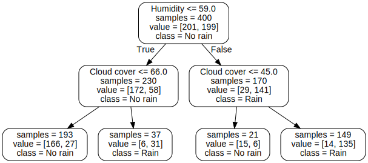
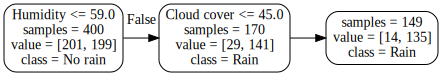

This is the first in a series of posts about decision trees in the context of machine learning. The goal here is to provide a foundational understanding of decision trees and implement them.

Decision trees are not amazing algorithms by themselves. They have limitations that can result in suboptimal and even weird predictions.
And yet, they have become extremely popular. Some would even say they are the _de facto_ go-to algorithm for many machine learning domains.
This is due to _bagging_ and _boosting_, techniques that turned subpar decision trees into state-of-the-art algorithms. We'll explore them in the future.

First, we'll build an intuition for what are decision trees and define them mathematically. Then, we'll explore how decision trees are built. This will allow us to grasp their main characteristics, advantages and disadvantages.
I will try to introduce complexity gradually, but I will assume you have some knowledge on mathematical notation, statistics and basic machine learning concepts.

If things become too complicated, try to read the provided references.
I've drawn upon various sources instrumental to my understanding of decision trees, including books, documentation, articles, blog posts and lectures.
Even if you understand everything, check the references: there is great content there.

## What is a decision tree?

Imagine you're trying to decide whether to take an umbrella when leaving home. You might ask questions like: _"Are there clouds?"_. If yes, you might then ask _"What's the humidity level?"_. Each question helps you narrow down the decision. This is how a decision tree works.

Let's simulate this weather example:

A decision tree can be thought of as making consecutive decisions by asking a series of questions about our data.
Each internal tree _node_ uses a certain feature (in our example, cloud cover or humidity) to divide its region into two using a split value.
Each new region can be further divided into two. A node that divides its region into two is called an _internal node_.

_Leaf (or terminal) nodes_ don't ask any more questions, but rather provide a prediction for its region. In our example, it might say _"Rain"_ or _"No rain"_. More precisely, it assigns a probability for each outcome.

Let's take a look at a decision tree fitted to our weather example:

This decision tree was kept intentionally small.
From top to bottom, this graph represents all decision boundaries of our simple tree.
Each internal node produces two _branches_, that is, two paths that can be followed. These branches recursively partitions the feature space such that the samples with the same labels or similar target values are grouped together.
For instance, we predict that it'll rain if humidity is above 59% and cloud cover is above 45% (rightmost path in the graph) because most points (_instances_) in this region are of the "Rain" class.

The class shown is only relevant for leaf nodes, that is, those at the bottom row.
The `value` property shows how many samples there are for each class in each region.
A _pure node_ has only instances of one class in its region. Since all nodes contain at least one instance of both classes (that is, "Rain" and "No Rain"), all nodes are _impure_.
The objective during training is to _reduce impurity_ as much as possible. If all nodes are pure, then the tree has _zero error_ on the training data set. This is how decision trees learn.

This visualization of the tree is very easy to interpret. We can follow each path and clearly see why a prediction was made, that is, the model is easily _explainable_ (the opposite of a _black-box_ model). This is one of the reasons why decision trees are popular. Simple decision trees can even be applied in some practical settings (e.g. medicine) without machine assistance.

We can also visualize the decision boundaries of the tree by overlaying them onto the scatter plot of our data:

We can see the straight boundaries between regions. More formally, a decision tree is a hierarchical structure that recursively divide our features into _cuboid regions_. Since we have 2 features (2 dimensions) in our example, the cuboid regions are squares.

## Types of trees

Broadly, there are two types of decision trees: _classification_ and _regression_ trees. While they share the same fundamental structure and splitting methodology, they differ in their output and how they make predictions.

Classification trees are designed to predict categorical outcomes -- they assign input data to predefined classes or categories.
At each leaf node, the tree predicts the most common class among the training samples that reached that node.
Our weather example involves a classification tree and the leaves predict whether it will rain or not.
The prediction is made by counting the proportion of training samples of each class at the leaf node and selecting the majority class.
Think of it as the tree asking a series of yes/no questions about the input features until it can make an educated guess about which category the input belongs to.

Regression trees, on the other hand, predict continuous numerical values rather than categories.
Instead of predicting a class at each leaf node, regression trees typically output the average value of all training samples that reached that node.
For instance, a regression tree might predict a house's price based on features like square footage, number of bedrooms, and location.
Each split in the tree tries to group together similar numerical values.
When a new example comes in, the tree can guide it to a leaf node containing training examples with similar target values and use their average as the prediction.

## Mathematical definition

Mathematically, a decision tree can be described as:

$$
f(x) = \sum_{m=1}^{M} c_m \mathbb{I}(x \in R_m)
$$

Where $x$ are the input features, $R_m$ is the $m$'th region and $c_m$ is the value of this region. $\mathbf{I}(x \in R_m)$ is 1 if $x$ is contained in the $m$'th region, 0 otherwise. The values $c$ are typically a constant (regression) or a vector of probabilities (classification). The combination of regions and values defines the decision tree.

The regions cannot assume arbitrary boundaries, though. They are always _parallel_ to some axis and can only divide a previous region into two.
This can be a limitation, but it greatly reduces the computational complexity of constructing a decision tree. In our weather example, it's trivial to find the following decision boundary using other methods (I have used logistic regression):

However, axis-parallel splits (single feature) are much easier to compute than oblique splits (multiple features). Finding the best split of a single feature involves sorting the data and evaluating splits.
Since the latter is negligible compared to sorting, this operation has a [time complexity](https://en.wikipedia.org/wiki/Time_complexity) of $O(n \log n)$, where $n$ is the number of data points.
To find the best oblique split combining two features, however, we must first consider all possible $O(n^2)$ lines formed by pairs of points.
For each line, you need to evaluate which side each point falls on: $O(n)$. This amounts to a total time complexity of $O(n^3)$.
More generally, an oblique split has a time complexity of $O(n^{d+1})$, in which $d$ is the number of features.
Therefore, we compromise on using only axis-parallel splits, which define cuboid regions.

Each region $R_m$ is defined by a path from the root to the $m$'th leaf of the tree. For instance, consider the path that defines the region $R = \{(Humidity,\ Cloud)\ |\ Humidity > 59\ \text{and}\ Cloud > 45\}$.

This region can be visualized on the scatter plot:

Unlike linear models, decision trees do not model the entire data distribution. Rather, each region has independent predicted values.
More formally, adding all independent regions defines a [piecewise function](https://en.wikipedia.org/wiki/Piecewise_function) that can approximate any pattern in the data, but it may struggle to represent smooth or continuous functions properly.

## Bias-variance tradeoff

TODO add sources

As all other machine learning algorithms, trees are also haunted by the bias-variance tradeoff.
If this concept is new to you, I highly recommend reading about it first, but come back later.

  
Bias-variance tradeoff refresher

  In summary, _bias_ refers to the error that a model makes due to
  oversimplification of relationships between features (_underfitting_).
  _Variance_ measures how sensitive model predictions are to small fluctuations
  in the training set. High variance means that the model is capturing _noise_
  rather than true relationships (_overfitting_). Reducing bias tends to
  increase variance and vice-versa. Finding an optimal bias-variance balance is
  crucial to achieve good prediction accuracy.

### Decision tree variance

Due to the non-linear and non-smooth nature of trees, they easily capture noise.
Thus, deeper trees present more variance.
If you fully grow a tree, it will partition the feature space until the error is zero[^almost_zero_error].
The model will have effectively _memorized_ the training set -- including noise -- which results in _overfitting_.

[^almost_zero_error]: The error may not reach zero if and only if there are two or more points with _exactly_ the same feature values but different target values.

If we rebuild our example tree until the error is 0 we get the following regions:

It has perfect accuracy, but it has very unusual boundaries due to noise (high variance). This model doesn't generalize well, that is, it would score poorly with new data. There are different ways to limit tree variance, namely:

- Limiting depth
- Requiring a minimum number of points per node
- Requiring a minimum decrease in loss to split the node (usually not a good idea)

TODO: The last one is usually not a good idea for a reason we'll see later.

Another possibility is to fully grow the tree and later _prune it_ to balance complexity and accuracy.

Let's build decision trees with increasing depths on a toy dataset:

import TreeDepthSlider from "@assets/js/climbing-trees/frame-slider.tsx";

<TreeDepthSlider client:load />

On the left we can see the training set[^sampling] with two features and two classes. We're building _classification_ trees, whose boundaries are overlaid onto the left plot.
The plot on the right shows training and test error, as well as the error of a logistic regression model as a baseline.
The test set was sampled from the same distribution, but is different from the training set.
Use the slider to compare depths. We can see that the best test error happens with a depth of 3.
Increasing the depth further results in overfitting.

### Decision tree bias

Even with a depth of three in the example above the error is larger than the logistic regression baseline. This is an example where linear models outperform decision trees due to the _additive structure_ of the data. The [logistic regression](https://en.wikipedia.org/wiki/Logistic_regression) equation in this case is:

$$
logit(p) = \beta_{0} + \beta_{1} x_{1} + \beta_{2} x_{2} + \varepsilon
$$

Where $p$ is the probability of the outcome being of class 1. Ignoring constants and the noise ($\varepsilon$), the probability is determined by a linear combination of both features. The relationship between features is not _hierarchical_, therefore decision trees require multiple, sometimes redundant, splits to approximate this concept, leading to deep or overly complex trees.

There are other concepts that fall under the same category, such as:

- XOR (Exclusive OR): the output is of one class if _exactly one_ (but not both) of two inputs is true.
- Parity problem: the output is different if the number of true values in a set of inputs is even or odd.
- Multiplexer problem: a multiplexer selects one of several input values based on a separate "selector" input.

These may seem overly specific, but they're used as benchmarks to test the capabilities machine learning algorithms.
Additive structure, XOR and parity involve global dependencies that require multiple inputs to be considered together.
Decision trees split data based on one feature at a time, therefore are inefficient at capturing these relationships.
Multiplexer problems require conditional rules which are not hierarchical, making the tree very large to account for all combinations of selector-input pairs.

In more complex real-world datasets, it's quite likely that multiple non-hierarchical concepts are present, leading to large biases. If they have subpar variance _and_ bias, decision trees may look like a poor choice of algorithm. Indeed, they rarely shine on their own, but rather as _ensembles_ (with bagging or boosting), which we'll cover in the future.

[^sampling]: Each class was sampled from a Bivariate (2D) Gaussian distribution with SD=1. One class is shifted by 1.5 units both up and to the right.

  
The staircase effect

  TODO ...

## Objective functions

We need to define objective functions to optimize during training. Classification trees optimize either Gini impurity or entropy.
Regression trees usually use mean squared error.

In all examples, consider the data $\mathcal{D} = \{(x_1, y_1), ..., (x_n, y_n)\}, y_i \in \{1, ..., c\}$ where $c$ is the number of classes.

### Misclassification rate

$$
MR(\mathcal{D}) = \frac{\sum_{i=1}^n \mathbb{I}(\hat{y}_i \neq y_i)}{n}
$$

This is a very intuitive objective for classification. It measures the proportion of misclassified examples.
The prediction $\hat{y}$ is the majority vote of the node. Our goal is to decrease leaf node impurity, which is aligned with the misclassification rate function.

### Gini impurity

The Gini impurity[^gini_confusion] over a set of class probabilities $p$ is defined as:

[^gini_confusion]: Not to be confused with the [Gini coefficient](https://en.wikipedia.org/wiki/Gini_coefficient)

$$
G(\mathcal{D}) = \sum_{k=1}^{c} p_{k}(1 - p_{k}) = 1 - \sum_{k=1}^c p_{k}^2
$$

It measures how often a randomly chosen element of a set would be incorrectly labeled if it were labeled randomly and independently according to the distribution of labels in the set.
When the node is pure, one class has a probability of 1 and the rest 0, so the Gini impurity is also 0.
The worst Gini impurity arises when the probabilities are uniform among classes, that is, a node with maximum Gini impurity is no better than a coin toss at classifying examples.
It can be shown that the upper bound of Gini impurity is 1 as the number of classes grow.

To evaluate the quality of a split ($\mathcal{S}$), we calculate the Gini impurity of each child node and take the weighted average.

$$
G(\mathcal{D}|\mathcal{S}) = \frac{|\mathcal{D}_L|}{|\mathcal{D}|} G(\mathcal{D}_L) + \frac{|\mathcal{D}_R|}{|\mathcal{D}|} G(\mathcal{D}_R)
$$

Where $\frac{|\mathcal{D}_L|}{|\mathcal{D}|}$ is the fraction of inputs in the left child node and $\frac{|\mathcal{D}_R|}{|\mathcal{D}|}$, in the right.

### Entropy

$$
H(\mathcal{D}) = - \sum_{k=1}^{c} p_{k}\ log_{2} p_{k}
$$

The entropy criterion is a concept from information theory (Shannon entropy).
It measures the average level of uncertainty of a set of probabilities.
In other words, it's the expected amount of information required to describe the potential outcomes.
When probabilities are uniformly distributed entropy is maximum, just like Gini impurity.
To understand the connection between information and probabilities, consider you have a set with two classes that are equally likely (let's say red and blue).
If you draw a sample, you have the least possible amount of certainty about which color you've drawn.
On the other hand, if red has a 95% probability, you can be pretty confident about which color you'll draw -- this has much lower uncertainty.
When probabilities are uniform you need extra information to accurately convey the result of a series of draws.

The range of the entropy criterion is from 0 to $log_{2}(c)$. We also take the weighted average of child nodes to evaluate the quality of a split:

$$
H(\mathcal{D}|\mathcal{S}) = \frac{|\mathcal{D}_L|}{|\mathcal{D}|} H(\mathcal{D}_L) + \frac{|\mathcal{D}_R|}{|\mathcal{D}|} H(\mathcal{D}_R)
$$

It's also common to see the objective function expressed in terms of _information gain_, which is the decrease in entropy yielded by a node split.

$$
IG(\mathcal{D}) = H(\mathcal{D}) - H(\mathcal{D}|\mathcal{S})
$$

It represents the amount of information gained about our target variable given our split. In these terms, the objective is to maximize information gain.

### Comparing classification objectives

Although misclassification rate is intuitive and commonly used as a model metric, it's not used as an optimization objective.
We can come up with splits ($\mathcal{S}$) that have the same misclassification rate, but one has a pure node while the other doesn't. For instance:

$$
\mathcal{S} = \{A: 10, B: 0\},\ \{A: 10, B: 5\}
$$

$$
\mathcal{S}' = \{A: 10, B: 2\},\ \{A: 10, B: 3\}
$$

Both splits misclassify 5 samples of class B (same misclassification rate), however the first has a pure node.
From an optimization perspective, we should favor pure nodes since they reduce the number of subsequent splits.
You can check that indeed both the entropy and the Gini impurity of the second split are higher.

  
Checking that the affirmation holds

Misclassification rate:

$$
MR(\mathcal{S}) = \frac{10}{25} 0 + \frac{15}{25} \frac{5}{15} = 0.2
$$

$$
MR(\mathcal{S}') = \frac{12}{25} \frac{2}{12} + \frac{13}{25} \frac{3}{13} = 0.2
$$

$$
MR(\mathcal{S}) = MR(\mathcal{S}')
$$

Gini impurity:

$$
G(\mathcal{S}) = \frac{10}{25} 0 + \frac{15}{25} 0.444 = 0.266
$$

$$
G(\mathcal{S}') = \frac{12}{25} 0.277 + \frac{13}{25} 0.355 = 0.318
$$

$$
G(\mathcal{S}) < G(\mathcal{S}')
$$

For the same reason, a tree may get "stuck" when there is no split that minimizes the misclassification rate. Gini impurity and entropy consider probabilities, while misclassification rate considers only the majority vote and therefore is not sensitive enough.

More formally, both Gini impurity and entropy are strictly concave.
In a strictly concave function there is (almost)[^almost_always] _always_ a split which results in a lower child node average.
If you take two points on the curve of a strictly convex function and draw a line between them, the line will be _always below_ the curve.

[^almost_always]: Here, again, this split doesn't exist only if all points have the exact same feature values.

> Plot of entropy $H(p)$ over probabilities $p$ with two classes. The probability of the second class is $(1 - p)$.

We know from the [data processing inequality](https://en.wikipedia.org/wiki/Data_processing_inequality) that the average entropy cannot increase after a split. Either a split reduces entropy in both child nodes -- which results in lower average entropy compared to the parent node -- or one child node has higher entropy than the parent node and the other lower.
Both child nodes cannot have higher entropy than the parent node because this would mean that the split _created_ new information (uncertainty), violating the data processing inequality.
Thus, we only need to show that the average entropy decreases when one child node has higher entropy and the other lower compared to the parent node.
The strict concavity of the entropy function is enough to ensure this.

The average child node entropy lies somewhere along the line between the points of both child nodes in the curve.
The average probability must be the same of the parent node, so the average child node entropy always lies below the parent node entropy.

misclassification rate is not strictly convex.
The average misclassification rate of child nodes is equal to that of the parent node when both child nodes lie on the same side of the function halting the optimization process.

### Squared loss

$$
L(\mathcal{D}) = \frac{1}{N} \sum_{i=1}^N (y_{i} - \bar{y})^2
$$

The squared loss function is the primary optimization criterion for _regression_ trees.
In this equation, $\bar{y}$ represents the mean value of the target variable $y$ within a specific node.
This value becomes the prediction ($c$) for all observations that fall into that node, following the [mathematical definition](#mathematical-definition) of decision trees.

While this formula resembles the traditional mean squared error (MSE) used in many statistical applications, there is an important distinction.
In standard regression models, MSE typically measures the difference between predictions ($\hat{y}$) and actual values, where $\hat{y}$ can be directly optimized through model parameters.
However, in the context of decision trees, this squared loss function actually quantifies the _within-node variance_ of the target variable.

This variance interpretation leads to an intuitive understanding of the tree-building process: the algorithm seeks splits that maximize the reduction in variance between the parent node and its children.
This approach, often termed variance reduction, effectively partitions the data into increasingly homogeneous subgroups with respect to the target variable.
The optimal split is one that creates child nodes with minimal average variance, thereby improving the tree's predictive accuracy.

## Building a decision tree

A sufficiently large tree will have one training sample per node, effectively memorizing the training set. This achieves 0 training error but is a pathological case. Our optimization goal is to build the _smallest possible_ tree that achieves 0 training error.
If limits such as maximum depth are enforced, we should find the tree that minimizes the objective while respecting such limits.

Unfortunately, the complexity grows combinatorially and finding the optimal tree is NP-complete.
It would be nice to build trees before the heat death of the universe, so we proceed with a _greedy algorithm_.
We make a series of locally optimal choices, hoping that it leads to a solution somewhat close to the global optimum.

Let's build a classification tree using the Gini impurity criterion. Starting with all of the data and the first variable, we test _all possible_ split points ($N - 1$ splits) and choose the one with the lowest criterion. Then, we repeat this procedure with all other features. The split with the lowest criterion over all features is chosen. Finally, we repeat the procedure for the left and right child nodes recursively until the criterion is 0 in all nodes or until a tree size limit is reached.

This process is short-sighted because splits do not consider the quality of downstream splits.
A split may capture noise of a variable if it leads to the best criterion, even though a (locally) suboptimal split would lead to better subsequent splits.
In the worst case, a single data point can completely change the final decision tree.
Thus, the greedy approach is another source of _variance_.
It's also the reason why requiring a minimum decrease in loss to split the node is not a good idea: a split may provide almost no immediate improvement but may be required to find good splits afterward.

## References

- Cornell CS4780 (Fall 2018) By Kilian Weinberger
  - [Overview](https://www.cs.cornell.edu/courses/cs4780/2018fa/)
  - [Decision tree lecture](https://www.youtube.com/watch?v=a3ioGSwfVpE)
  - [Decision tree lecture notes](https://www.cs.cornell.edu/courses/cs4780/2018fa/lectures/lecturenote17.html)
- [Scikit-learn documentation on trees](https://scikit-learn.org/stable/modules/tree.html)
- [Wikipedia on decision tree learning](https://en.wikipedia.org/wiki/Decision_tree_learning#Gini_impurity)
- Machine Learning STAT 479 (Fall 2018) by Sebastian Raschka
  - [Overview](https://pages.stat.wisc.edu/~sraschka/teaching/stat479-fs2018/)
  - [Decision trees notes](https://sebastianraschka.com/pdf/lecture-notes/stat479fs18/06_trees_notes.pdf)
- C. Bishop, Pattern Recognition and Machine Learning. Springer New York, 2016.
- K. Murphy, Machine Learning: A Probabilistic Perspective. MIT Press, 2012.
- Hastie, T., Tibshirani, R., & Friedman, J. (2009). The Elements of Statistical Learning: Data Mining, Inference, and Prediction, Second Edition. Springer New York.
- Breiman, L., Friedman, J., Stone, C., & Olshen, R. (1984). Classification and Regression Trees. Taylor & Francis.
- [Data processing inequality - Wikipedia](https://en.wikipedia.org/wiki/Data_processing_inequality)
